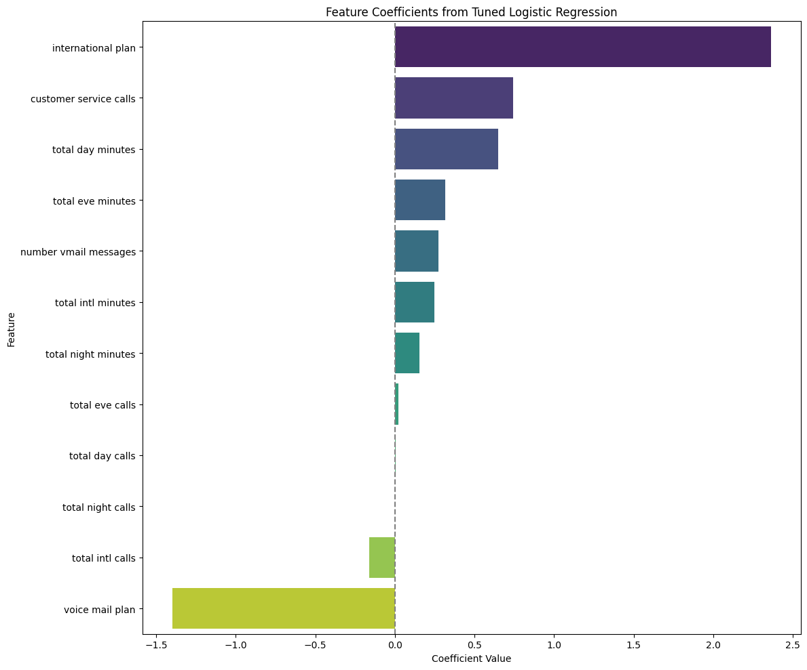

# SyriaTel Customer Churn Prediction

## Project Overview.

Customer churn is a major challenge for SyriaTel Communications Company. Acquiring new customers is significantly more expensive than retaining existing ones. This project applies machine learning techniques to identify customers likely to discontinue their services, enabling proactive retention strategies.

## Problem Statement

SyriaTel needs to identify at-risk customers to minimize revenue loss from churn. By analyzing customer data including usage patterns, plan subscriptions, and service interactions, we can build predictive models to:

- **Identify** customers likely to churn
- **Prioritize** high-risk segments for targeted interventions
- **Minimize** revenue loss through early retention efforts

## Objectives

1. Build a binary classification model to predict customer churn (1 = churns, 0 = stays)
2. Train and compare multiple classification models:
   - Logistic Regression
   - Decision Tree Classifier
3. Evaluate model performance using churn-focused metrics:
   - **Recall** - to detect churners
   - **Precision** - accuracy of positive predictions
   - **F1-Score** - balance between precision and recall
   - **ROC-AUC** - overall model discrimination ability
   - **Accuracy** - overall correctness
4. Provide data-driven recommendations for customer retention strategies

## Stakeholders

- **SyriaTel Management** - Strategic decision-making on retention initiatives
- **Marketing Department** - Targeted intervention campaigns and personalized offers
- **Customer Service** - Priority support for at-risk customers

## Dataset

**Source:** SyriaTel Communications Company  
**Records:** 3,333 customer records  
**Features:** 21 original columns (after preprocessing: 12 features)  
**Target Variable:** `churn` (binary: yes/no)

### Data Characteristics

- **No Missing Values** - Complete dataset with all records populated
- **Class Imbalance** - 85.51% no churn, 14.49% churn
- **Data Types** - Mix of numerical and categorical variables

## Key Findings from EDA

### Churn Distribution
- **Churners:** 14.49% (482 customers)
- **Non-churners:** 85.51% (2,851 customers)

### High-Risk Patterns
- 
- From the graph, clients on international plan has the highest of chunners, folllowed by customer service calls, total day minutes and total evening minutes

### Feature Relationships
- Strong multicollinearity between usage minutes and charges
- Dropped charge-related columns to reduce multicollinearity
- Retained core usage metrics for modeling

## Data Preparation

### Preprocessing Pipeline
1. **Separated** target variable (churn) from features (X, y split)
2. **Removed** non-predictive columns:
   - Account identifiers (phone number, state, area code)
   - Redundant charge columns (day charge, eve charge, night charge, intl charge)
3. **Split** data into training (70%) and test (30%) sets
4. **Standardized** numerical features using StandardScaler
5. **Encoded** categorical variables using OneHotEncoder (drop_first strategy)

### Train-Test Split
- **Training Set:** 2,333 samples
- **Test Set:** 1,000 samples
- **Random State:** 42 (reproducibility)

## Models & Results

### Model Comparison

| Model | Recall | Precision | F1-Score | Accuracy | ROC-AUC |
|-------|--------|-----------|----------|----------|---------|
| Logistic Regression       | 0.216 | 0.574 | 0.314 | 0.865 | 0.83 |
| Tuned Logistic Regression | 0.804 | 0.370| 0.507 | 0.8777 | 0.835 |
| Decision Tree             | 0.748 | 0.718 | 0.732 | 0.922 | 0.817 |
| **Tuned Decision Tree**   | **0.811** | **0.534** | **0.644** | **0.872** | **0.867** |

### Best Model: Tuned Decision Tree

**Hyperparameters:**
- `max_depth=7` - Controls tree depth
- `min_samples_split=12` - Minimum samples to split a node
- `min_samples_leaf=15` - Minimum samples in leaf nodes
- `max_leaf_nodes=60` - Maximum number of leaf nodes
- `class_weight='balanced'` - Handles class imbalance

**Performance:**
- **Recall: 81.1%** - Successfully identifies 81% of churners
- **Precision: 53.4%** - 53% of predicted churners are correct
- **F1-Score: 64.4%** - Good balance between precision and recall
- **Accuracy: 87.2%** - Overall correctness
- **ROC-AUC: 86.7%** - Superior ability to rank customers by churn risk

**Confusion Matrix:**
- True Negatives: 849 (correctly identified non-churners)
- False Positives: 89 (non-churners predicted as churners)
- False Negatives: 46 (churners missed by model)
- True Positives: 161 (correctly identified churners)

## Key Insights

1. **Model Selection:** Tuned Decision Tree provides the best balance with highest ROC-AUC (86.7%) and superior recall (81.1%)

2. **Recall Priority:** High recall ensures SyriaTel captures most at-risk customers, though some false positives require targeted resources

3. **Churn Drivers:**
   - High daytime usage (>224.76 minutes)
   - International plan subscribers
   - Frequent customer service interactions

4. **False Negatives Warning:** 46 customers were predicted as non-churners but actually churned - these represent critical business risk

## Recommendations

### 1. Target High-Usage Day Customers

**Challenge:** Customers with high daytime usage show 34% churn rate

**Solutions:**
- **Daytime Bundle Discounts** - Offer tiered day-minute packages with volume incentives
- **Loyalty Programs** - Award frequent users with bonus minutes, rollover credits, or free services
- **Personalized Retention** - Proactively offer free call/data bundles during high-usage periods

### 2. Focus on International Plan Subscribers

- Create exclusive retention offers for international plan customers
- Provide premium support channels for this high-value segment
- Monitor usage patterns for early warning signs

### 3. Improve Customer Service Experience

**Insight:** High customer service call frequency correlates with churn

**Actions:**
- **Fast-Track Resolution** - Expedite complaint handling for at-risk customers
- **Priority Support** - Assign dedicated support teams to frequent service callers
- **Proactive Communication** - Reach out before problems escalate

### 4. Address False Negatives

- Monitor the 46 customers predicted as non-churners but who churned
- Implement additional early warning signals beyond model predictions
- Create escalation procedures for unexpected churn events

## Conclusion
 - For example, international plan- these are customers who are more likely to churn.  For this segment of client, pricing and proper ustomer support can curb their churning. Additionally,they can be given discounted offers and better call rates.

 - Customer service calls- This are also customers who are at an increasedrisk of churning.  Poor customer service often turn customers away. Therefore, by SyriaTel investing in tbetter customer care, assigning priority to the internation plan clients, faster resolution mechanisms and proactive outreach can reduce this segment of clients from churning.

 - Also additional value added sevices to some segments such as voicemail can boost retention from this clients.From our datasets, SyriaTell should focus on the portion of clients who are falling in the false negative bit. Clients who the model has predicted that they are not churning when they are infact about to churn, or have churned.

For the day clients, the following strategies can be used in order to reduce them from churning. The following can be done:
- discounting the bundles during daytime
- Personalized retention such as offering free bundles or call for a duration at at a time. If they buy minutes during the day for calling, they get extra minutes and some bundles.

- Also, since the day customers are the high usage of the products are service, SyriaTel could award them through targeted loyalty programs.
